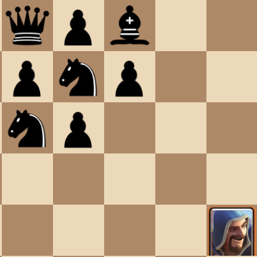
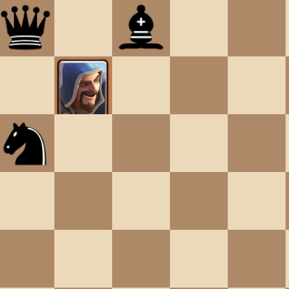
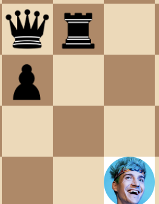
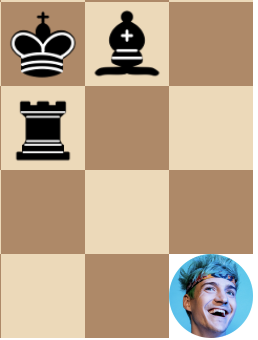

# Chess 2

We have took it up in our own hands to update chess. Introducing Chess 2, a novel twist to the thousand-year-old game. With fascinating new pieces like the wizard and giant, you are sure to have fun playing this remix.

TODO:
 - More TailwindCSS
 - Docs on new pieces
 - Docs on board notation
 - Make chessboard.svelte a seperate npm package

## What changed?

Chess 2 inherits all the rules and pieces from chess EXCEPT the following:

## New pieces

### Wizard (W)

The wizard moves like a bishop + moving up or down 1 square.

It can do splash damage when it attacks a piece.

For example, if the wizard takes the knight



Then the pawns get taken as well



Yep, a **plus-shaped splash**.

### Warlock (L)

**NOTE: Name subject to change**

The warlock moves like a wizard (they're synonyms!) but when it takes a piece, the warlock **has to** move/attack like the piece it took.

On a physical chess board, this storage might be implemented as stacking the warlock on top of the last taken piece.

<details>

<summary>Thought process</summary>

Having a piece that can turn into pieces it pretty OP. So the nerf is this:

 - **Forced to** "turn" into the piece

This helps you do stuff like protect your powerful pieces like the [archer](#archer-a) or the queen with pieces like the pawn.

</details>

### Ninja (J)

The ninja is swift, sneaky, and a big coward.

It moves like a bishop.

When a ninja takes a piece, it may choose to chain up to 2 other pieces adjacent to the piece it took.

For example, if the ninja takes the pawn



it can also choose to take the queen or the rook or both.

But since it is a coward, it **cannot** chain to a king. So in this position, the king is not in danger since the ninja may only take the rook (and the bishop as well if desired):



<details>

<summary>Thought process</summary>

Ninja is probably one of my favorite pieces. It can chain which allows for practically annihilating rows of undeveloped pieces (if it can get there in time). Having it chain up to 2 is quite a nerf although we might reduce it even more if it still deems too strong.

</details>

### Archer (A)

The archer snipes pieces from a distance. It doesn't move to take the piece. It attacks like a rook.

But then, how *does* it move? **Like a king**. It also cannot take pieces 1 square diagonal to it.

### Giant (G)

TODO: explain

## Board changes

The board has been expanded to a 16x16 board to accommodate space for the new pieces.

### Board notation

I'm using my own kind of board notation for specifying what a board's current position looks like (for selfish coder reasons).

So it goes like

```html
<dimension> <data>
```

Where dimension is a number ranging from 1 to 26 representing the board's side length and size is a string in the form of the regex `/([1-9]+|[a-zA-Z])+/`.

TODO: explain this better

## Balance changes

None yet although we may buff the knight soon
